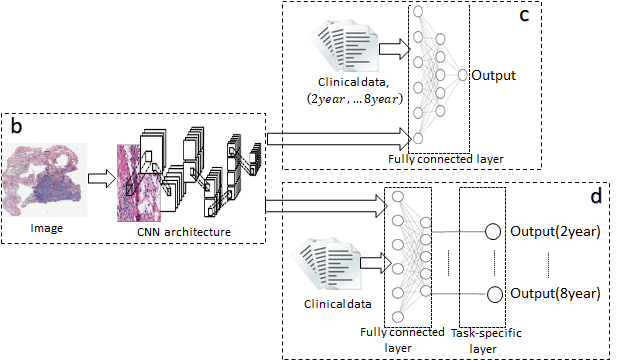

# POCNN
## A deep convolutional neural netwok approach for predicting cumulative incidence based on pseudo-observations



## Requirements
Install the following R packages: 

`utils.install_packages('prodlim')`

`utils.install_packages('eventglm')`

We use the functions `pseudo_coxph` from eventglm  and  `prodlim` and `jackknife` from prodlim.

## Simulations

The folder named Simulations contains the files to replicate the simulations.
The dataset CIFAR10 (https://www.cs.toronto.edu/~kriz/cifar.html) will be saved in the current directory under the folder name `./dataset_cifar`. You can speficy the directory passing the argument  `--dir`

Common **arguments:**

* `--lr`: learning rate (default = 0.01)

* `--sample_size`: sample size (default=1000)

* `--nsim`: number of simulated data (default=100)

* `--case`: any case/scenario considered in the paper, there are six cases (default=1)

* `--data_dir`: directory to save CIFAR10 dataset (default='./dataset_cifar')

Specific to PO and IPCW-PO:

* `--po`: data generation using PO or IPCW-PO, it takes 'po' or 'ipcwpo' (default='po')

For example:

To train and evaluate IPCW-PO-CNN single output :
```sh
python train_eval_pocnn.py --sample_size 1000 --nsim 50 --niter 25 --case 5 --po 'ipcwpo'
```

To train and evaluate IPCW-PO-CNN multi-output :
```sh
python train_eval_pocnn_multioutput.py --sample_size 1000 --nsim 50 --niter 25 --case 5 --po 'ipcwpo'
```

To train and evaluate Cox-PO-CNN :
```sh
python train_eval_coxcnn.py --sample_size 1000 --nsim 50 --niter 25 --case 5
```


## Real data application
The folder named real_data_application contains the files to run PO-CNN, IPCW-PO-CNN and Cox-CNN using the TCGA dataset based on tile's images and clinical data.

The file TCGA_clinical.csv contains the clinical data (structured data). The column `Test` indicates the patients that we consider in the training set and test set.

The file clinical_data.py contains different functions to format the data corresponding to the model:
- `get_clinical_data_po` pre-processes the structured data to be used in PO-CNN
- `get_clinical_data_ipcwpo` pre-processes the structured data to be used in IPCW-PO-CNN
- `get_clinical_data_cox` pre-processes  the structured data to be used in Cox-CNN


### Images 
The raw images can be downloaded from [GDC data transfer API](https://gdc.cancer.gov/access-data/gdc-data-transfer-tool).

#### Preprocessing
Each WSI was pre-processed before inclusion into this study (please see the Supporting Information). As a first step, tissue masks were generated. To this end, WSIs were downsampled by a factor of 32 and converted to the HSV color space. Tissue masks were generated by applying a pixel-wise logical “and” operation between a mask that was generated by applying the Otsu threshold (Otsu 1979) to the saturation channel and by applying a cutoff of 0.75 to the hue channel. We subsequently performed morphological opening and closing to remove salt-and-pepper noise from the binary masks. WSIs were then tiled with 50% overlap at 20X magnification into image patches spanning 598x598 pixels, where 598 pixels correspond to 271µm of tissue section, while discarding tiles with less than 50% tissue content. Tiles were then color-normalized using the method described by Macenko et al. 2009. We subsequently applied a cancer detection CNN to identify cancer regions and excluded all tiles that were predicted to belong to a benign tissue region. Furthermore, out-of-focus tiles with a low variance were excluded, which was computed by filtering each tile with a Laplacian. 

The tile's images (.jpg) for each patient are assumed to be stored in the folder of each patient under the id name. Each patient is identified by the id which can be found in the column `Sample ID Slide` in the clinical data. For instance: from the Sample ID Slide TCGA-D8-A1JK-01Z, the id is A1JK. In the folder A1JK should be stored all tile's images for that patient. 

N. Otsu, "A Threshold Selection Method from Gray-Level Histograms," in IEEE Transactions on Systems, Man, and Cybernetics, vol. 9, no. 1, pp. 62-66, Jan. 1979, doi: 10.1109/TSMC.1979.4310076.

M. Macenko et al., "A method for normalizing histology slides for quantitative analysis," 2009 IEEE International Symposium on Biomedical Imaging: From Nano to Macro, 2009, pp. 1107-1110, doi: 10.1109/ISBI.2009.5193250.

### Training, Evaluating and Test

To train, validate and test PO-CNN single-output (default arguments) :
```sh
python train_eval_test_pocnn.py 
```
To train, validate and test IPCW-PO-CNN single-output (default arguments) :
```sh
python train_eval_test_pocnn.py --po 'ipcwpo' 
```
To train, validate and test PO-CNN multi-output (default arguments) :
```sh
python train_eval_test_pocnn.py  --implementation 'multi_output'
```

**arguments:**

* `--max_num_epochs`:  number of epochs (default=30)

* `'--num_samples'`: number of times to sample from the hyperparameter space  (default=3)

* `---gpus_per_trial`: gpu resources to be used per trial (default=1)

* `--cpus_per_trial`: gpu resources to be used per trial (default=4)

* `--po_cnn`: 'po' or 'ipcwpo' (default='po')

* `--implementation`: to run PO-CNN using the approach single output ('single_output') or multi output ('multi_output') (default= 'single_output')

* `--data_dir_train`: directory where the train images are stored (default = './data/Macenko_new_normed_TCGA_size_1196_stride_598_resize_1' )

* `--data_dir_test`: directory where the test images are stored (default = './data/test_set/Macenko_new_normed_TCGA_size_1196_stride_598_resize_1')

To train, validate and test Cox-CNN using the average of per-tile's prediction as aggregation criteria (default):
```sh
python train_eval_test_coxcnn.py 
```
**arguments:**

* `--max_num_epochs`:  number of epochs (default=30)

* `'--num_samples'`: number of times to sample from the hyperparameter space  (default=3)

* `---gpus_per_trial`: gpu resources to be used per trial (default=1)

* `--cpus_per_trial`: gpu resources to be used per trial (default=4)

* `--aggregation_criteria`: 'average' or '75percentile' (default='average')

* `--data_dir_train`: directory where the train images are stored (default = './data/Macenko_new_normed_TCGA_size_1196_stride_598_resize_1' )

* `--data_dir_test`: directory where the test images are stored (default = './data/test_set/Macenko_new_normed_TCGA_size_1196_stride_598_resize_1')

